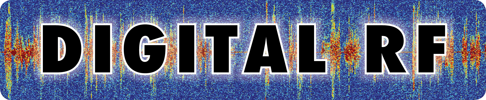

|DigitalRF|
===========

The Digital RF project encompasses a standardized HDF5 format for reading and writing of radio frequency data and the software for doing so. The format is designed to be self-documenting for data archive and to allow rapid random access for data processing. For details on the format, refer to the 'documents' directory in the source tree.

This suite of software includes libraries for reading and writing data in the Digital RF HDF5 format in C (``libdigital_rf``), Python (``digital_rf``) with blocks for GNU Radio (``gr_digital_rf``), and MATLAB. It also contains the `thor` UHD radio recorder script, Python tools for managing and processing Digital RF data, example scripts that demonstrate basic usage, and example applications that encompass a complete data recording and processing chain for various use cases.

Important Links
===============

Official source code repo: https://github.com/MITHaystack/digital_rf

Issue tracker: https://github.com/MITHaystack/digital_rf/issues

User mailing list for help/questions: openradar-users@openradar.org

Developer mailing list: openradar-developers@openradar.org

Dependencies
============

Build:

* cmake (``cmake``)
* hdf5 >= 1.8 (``libhdf5-dev``) [c, python]
* MATLAB >= R2016a [matlab]
* numpy (``python-numpy``) [python]
* pkgconfig (``python-pkgconfig``) [python]
* python == 2.7 (``python-dev``) [python]

Runtime:

* h5py (``python-h5py``) [python]
* hdf5 >= 1.8 (``libhdf5``) [c, python]
* MATLAB >= R2014b [matlab]
* numpy (``python-numpy``) [python]
* packaging (``python-packaging``) [python]
* python == 2.7 (``python``) [python]
* six (``python-six``) [python]

Additional optional runtime dependencies:

* dateutil (``python-dateutil``) [python:thor]
* gnuradio (``gnuradio``) [python:gr_digital_rf]
* gr-uhd (``libgnuradio-uhd``) [python:thor]
* python-sounddevice (``pip install sounddevice``) [python:drf_sound]
* pytz (``python-tz``) [python:thor]
* watchdog (``python-watchdog``) [python:watchdog]

Installation
============

Using source code package
-------------------------

First, ensure that you have the above-listed dependencies installed.

Clone the repository and enter the source directory::

    git clone https://github.com/MITHaystack/digital_rf.git
    cd digital_rf

Create a build directory to keep the source tree clean::

    mkdir build
    cd build

Build and install::

    cmake ..
    make
    sudo make install

Finally, you may need to update the library cache so the newly-installed ``libdigital_rf`` is found::

    sudo ldconfig

Note that it is also possible to build the different language libraries separately by following the CMake build procedure from within the `c`, `matlab`, and `python` directories.

The MATLAB toolbox is not created by default. If you have MATLAB R2016a or higher and want to create an installable toolbox package, run the following from the build directory::

    make matlab

The toolbox package will then be found at `build/matlab/digital_rf.mltbx`.

Using Conda package
-------------------

Alternatively, you can install digital_rf using our `Conda <https://conda.io/docs/>`_ binary package. Our package is compatible with the `conda-forge <https://conda-forge.github.io/>`_ distribution of community-maintained packages.

In an existing Conda environment, run the following to install digital_rf and its dependencies::

    conda config --add channels ryanvolz
    conda config --add channels conda-forge
    conda install digital_rf

Example Usage
=============

Python and C examples can be found in the examples directory in the source tree. The C examples can be compiled from the build directory by running::

    make examples

The following Python commands will load and read data located in a directory '/data/test'.

Load the module and create a reader object::

    import digital_rf as drf
    do = drf.DigitalRFReader('/data/test')

List channels::

    do.get_channels()

Get data bounds for channel 'cha'::

    s, e = do.get_bounds('cha')

Read first 10 samples from channel 'cha'::

    data = do.read_vector(s, 10, 'cha')

Testing
=======

To execute the C test suite, run the following from the build directory::

    make test

The python tests found in the tests directory in the source tree can be run directly after ``digital_rf`` has been installed.

Both the C and python tests create test files in '/tmp/hdf5*'. To cleanup afterward, run::

    rm -r /tmp/hdf5*

Acknowledgments
===============

This work was supported by the National Science Foundation under the Geospace Facilities and MRI programs, and by National Instruments / Ettus corporation through the donation of software radio hardware. We are grateful for the support that made this development possible.
